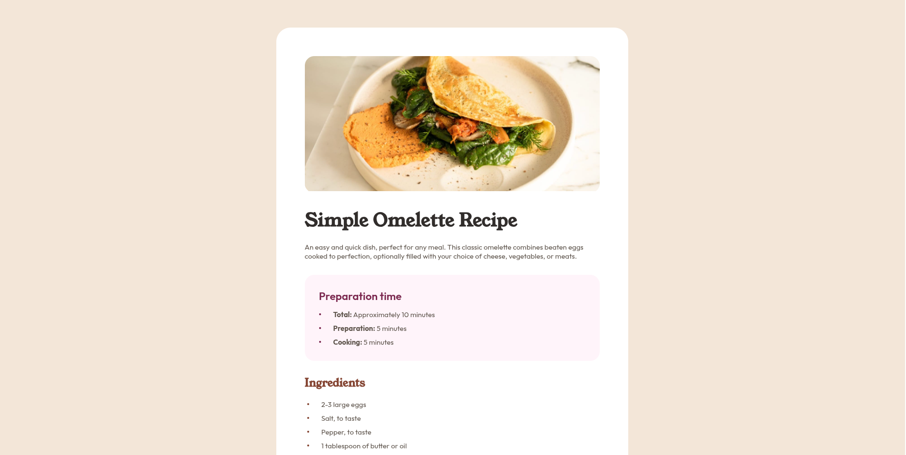

# Frontend Mentor - Recipe page solution

This is a solution to the [Recipe page challenge on Frontend Mentor](https://www.frontendmentor.io/challenges/recipe-page-KiTsR8QQKm). Frontend Mentor challenges help you improve your coding skills by building realistic projects.

## Table of contents

- [Overview](#overview)
  - [The challenge](#the-challenge)
  - [Screenshot](#screenshot)
  - [Links](#links)
- [My process](#my-process)
  - [Built with](#built-with)
  - [What I learned](#what-i-learned)
  - [Continued development](#continued-development)
  - [Useful resources](#useful-resources)
  - [AI Collaboration](#ai-collaboration)
- [Author](#author)
- [Acknowledgments](#acknowledgments)

## Overview

### The challenge

Users should be able to:

- View the optimal layout for the interface depending on their device's screen size
- See a recipe card that closely matches the provided design

### Screenshot



### Links

- Live Site URL: [Open live preview](https://async-kita.github.io/recipe-page/)

## My process

### Built with

- Semantic HTML5 markup
- CSS custom properties
- Flexbox
- CSS Grid
- Responsive design
- BEM (Block Element Modifier) class naming
- Custom fonts loaded with `@font-face`

### What I learned

This project gave me the opportunity to reinforce my layout skills and pay close attention to typography and detail. Some of the things I practiced and learned:

- Using CSS custom properties to manage colors and keep the stylesheet maintainable.
- Styling ordered lists with CSS counters so the numbers have a custom color and position.
- Creating custom bullet points with the `::before` pseudo-element.
- Building a responsive card layout that adapts from desktop to mobile with a single media query.
- Applying the BEM methodology to make class names readable and scalable.
- Loading and using local web fonts correctly with `@font-face`.

```css
.recipe-instructions__list {
  counter-reset: item;
}
.recipe-instructions__item::before {
  content: counter(item) ".";
  color: var(--brown-800);
}
```
